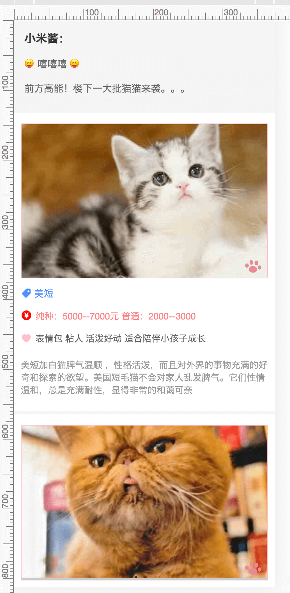
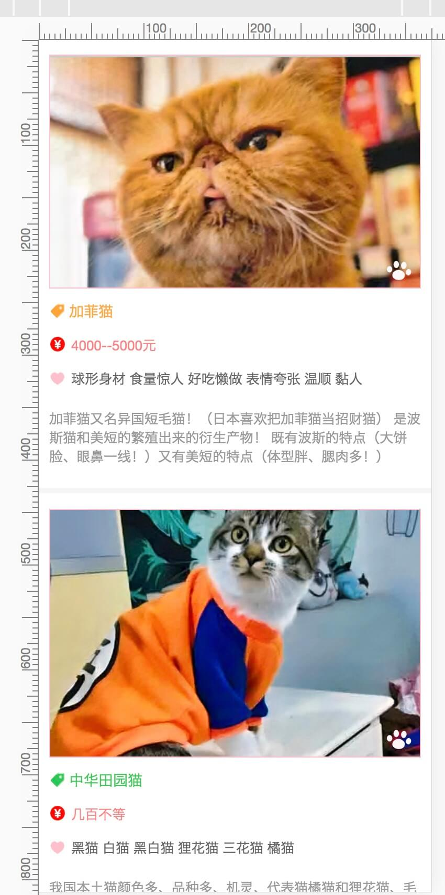
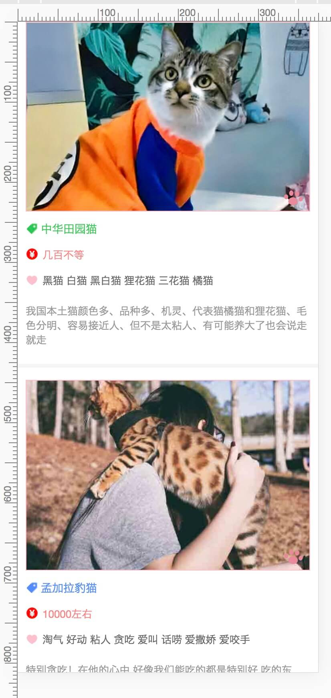
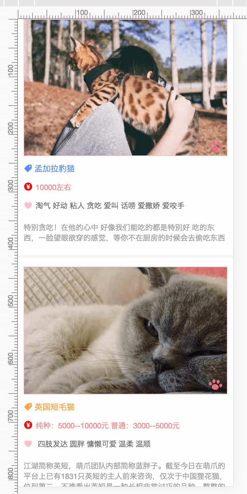

# react-rolling
用react组件写移动端滚动视差效果

## Build Setup

> ```
> # install dependencies
> npm install
>
> # serve with hot reload at localhost:3333
> npm start
>
> # build for production with minification
> npm run build
>
> ```


图片与文字产生的视差效果，向上滑动，仿佛图片从框内慢慢移入

效果如下：

| 1 | 2|
| ------------------------ | ---- |
| 3 | 4|


纯css实现滚动视差效果，无需借助js。

实现原理：

当位于3D空间中，给子元素设置不同的 transform: translateZ()，不同元素在3D Z轴方向距离屏幕（我们的眼睛）的距离也就不一样，这就形成了一种视差效果。

>```scss
># 下面为关键代码scss，不包含所有：
>.mm-reader {   /* 滚动容器 */
>    height: 100vh;
>    overflow-y: scroll;
>    perspective: 1px;     /* 重要, 使具有三维位置变换的元素产生透视效果 */
>
>    .img {   /* 包裹图片的容器 */
>        overflow: hidden;
>    }
>
>    img {   /* 产生视差效果的图片 */
>       width: 100%;
>      	height: auto;
>      	transform: translateZ(-0.1px) scale(1.34);
>    }
>}
>
>```
>
>
>
>========================End======================
>
>====================😊O(∩_∩)O~~==================

